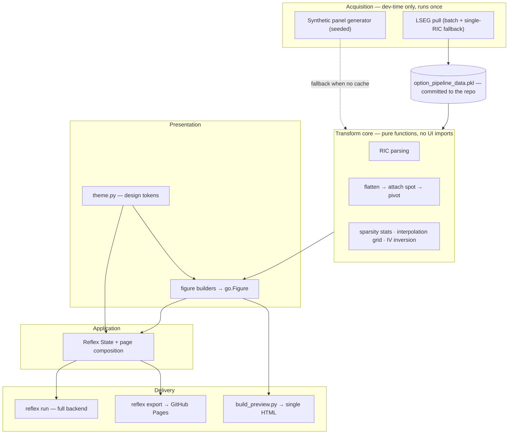
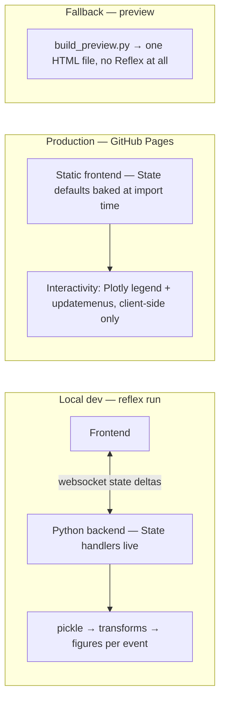

# Architecture — Options Surface Lab

| Field | Value |
|---|---|
| Status | Draft v1 — 2026-08-29 |
| Scope | Structure: layers, boundaries, decisions, change map |

**Division of labor across the docs folder** — open the right one:

| Doc | Answers |
|---|---|
| [ENGINEERING-PRINCIPLES.md](ENGINEERING-PRINCIPLES.md) | How we write and review code |
| [PRD.md](PRD.md) | What to build, why, priorities, acceptance criteria (FR-x / G-x IDs) |
| [SYSTEM-SPEC.md](SYSTEM-SPEC.md) | Detailed behavior: schemas, algorithms, sequences, edge cases |
| **ARCHITECTURE.md** (this) | Where things live, the load-bearing walls, why they were placed there, and where a given change belongs |

The structure below is **current** as of 2026-08-29 — the FR-1 restructure has landed.
Remaining not-yet-created pieces: `theme.py` (FR-8) and the CI workflow (FR-9).

---

## 1. Bird's-eye view

A data-visualization web app whose production form is a **static site with no backend**.
Market data is acquired **once**, at development time, into a pickle that is committed to the
repo; everything downstream — transforms, figures, the published page — renders from that
cache. The semester plan is one Reflex site that keeps gaining pages, so this week's
structure is the foundation, not a throwaway.

The single big idea: **data flows one way.**

```
LSEG (once) → pickle → pure transforms → figures → page → delivery
```

Nothing to the right of the pickle may reach back left (no network at render, no UI concerns
in transforms). Every architectural decision below exists to keep that arrow one-way.

## 2. Layers



Layer rules:

- **Acquisition** is the only layer allowed to touch the network, and it never runs in
  production (cache-first: an existing pickle short-circuits it).
- **Transform core** is pure pandas/numpy/scipy — it imports no Reflex, no Plotly, no theme.
  This is what makes it testable and what Assignment 1.2 will reuse untouched.
- **Presentation** turns frames into `go.Figure`s and knows nothing about Reflex state or
  routing. All visual constants come from `theme.py`.
- **Application** is the only layer that knows Reflex exists.
- **Delivery** is three shapes of the same code (§3); no module may assume which shape it is
  running in.

## 3. The three runtime shapes

The same codebase ships three ways; the architecture must hold in all three
(details: [SYSTEM-SPEC §2, §8.3](SYSTEM-SPEC.md)).



The consequence that shapes everything: in production there is **no Python at runtime**, so
default figures are computed at module import from the committed pickle and serialized into
the static build (AD-4), and every interactive control must be a Plotly-native, client-side
mechanism (AD-5). The Reflex event handlers are a local-dev enhancement.

## 4. Codemap

Where things live, and — the part that prevents drift — what does *not* belong in each.
Import rules as a table: [SYSTEM-SPEC §4](SYSTEM-SPEC.md).

**`rxconfig.py`** (repo root)
Reflex project config, `app_name = "options_surface_lab"`. Nothing else.

**`options_surface_lab/options_surface_lab.py`** — entry shim
Re-exports `app` so Reflex's `app_name` convention and the assignment's `*app.py` naming
both hold (AD-8). Must stay ~3 lines; logic here is a smell.

**`options_surface_lab/options_surface_app.py`** — application layer
`State` (vars + event handlers), page composition, import-time baking of default figures.
*Does not belong here:* dataframe surgery (→ utils), figure construction (→ plot), literal
colors/fonts (→ theme).

**`options_surface_lab/option_surface_utils.py`** — transform core
RIC parsing, flatten/attach/pivot, sparsity stats, interpolation grid, synthetic generator,
cache loading, (1.2+) IV inversion. Pure in/out; the only I/O is reading the pickle.
*Does not belong here:* anything importing Reflex or Plotly, anything that formats for
display.

**`options_surface_lab/option_surface_plot.py`** — presentation
One builder per figure, `frame(s) + selection → go.Figure`. All styling via `theme.py`.
*Does not belong here:* data reshaping beyond slicing/dropna (→ utils), Reflex components,
hardcoded hex values.

**`options_surface_lab/theme.py`** — design tokens
Semantic palette, font stacks, `figure_layout()` defaults. Imports nothing project-local.
The FR-8 restyle happens here and only here.

**`build_preview.py`** (repo root) — delivery fallback
Assembles the same figures into one static HTML file. Kept alive as the emergency Pages
artifact (AD-4 consequence).

**`tests/`** — mirrors the transform core first (parsing, pivot, stats, IV round-trip);
uses the seeded synthetic panel as its fixture (AD-7), exposed as the session-scoped
`synthetic_payload` / `synthetic_wide` fixtures in `tests/conftest.py`. The FR-3 chain is
covered as of 2026-08-29 (`test_ric_parsing.py`, `test_transforms.py`); the IV round-trip
lands with FR-11.

**`notebooks/`** — data exploration only, numbered (`01_…`) as the semester accumulates.
Notebooks import the package; nothing imports from notebooks, and no transform logic lives
in them — anything worth keeping graduates into `option_surface_utils.py` with a test
(AD-3 discipline). **Co-build policy:** every data/model capability (transforms, models,
new data) lands with a notebook companion in the same task; UI, theme, and deploy work
does not.

**`docs/`** — this folder. **`option_pipeline_data.pkl`** — the committed cache; treated as
an artifact with a frozen schema, not as code.

## 5. Load-bearing walls (interfaces that must not shift)

Three contracts hold the layers apart. Changing any of them is an architecture change, not a
refactor — update the docs first.

1. **The payload dict** (pickle contents) — acquisition's output, everyone's input.
   Additive changes only. Schema: [SYSTEM-SPEC §5.1](SYSTEM-SPEC.md).
2. **The wide table** — one row per (date, ric) with `TRDPRC_1`/`SETTLE` side by side; the
   frame every figure and future 1.2 feature consumes. Schema:
   [SYSTEM-SPEC §7.2](SYSTEM-SPEC.md).
3. **Theme tokens** — the only channel through which visual identity reaches components and
   figures. If a color bypasses it, the wall is breached (FR-8's acceptance test).

## 6. Architecture decisions

ADR-lite: context → decision → consequences. Numbered for citation in reviews and AI
sessions ("this violates AD-3").

**AD-1 — Commit the data; production runs offline.**
*Context:* LSEG needs credentials and a desktop session; graders and CI have neither; the
assignment mandates cache-first. *Decision:* pull once, commit
`option_pipeline_data.pkl`, make every downstream path (app, preview, tests, export) run
with zero network. *Consequences:* deployable anywhere static files are served; data is a
frozen snapshot (fine — the product teaches about historical data); repo carries a binary
(acceptable this week, revisit if later caches grow — PRD risk table).

**AD-2 — Synthesize candidate RICs; never walk the chain.**
*Context:* the LSEG derivatives-chain endpoint does not reliably return expired contracts
(instructor-confirmed dead end). *Decision:* generate every plausible RIC from the
documented grammar (Fridays × strike grid × C/P) and let the API reject the ones that never
existed. *Consequences:* over-requesting is normal (empty responses expected, batch → single
fallback required); silent blind spot if the underlying split in-window — hence FR-2's
pre-commit split check.

**AD-3 — Pure-function transform core.**
*Context:* the same transforms must serve the Reflex app, the preview builder, the static
bake, tests, and next week's vol-surface work. *Decision:* `utils` is side-effect-free
pandas/numpy with no UI imports; the app holds state, utils holds logic. *Consequences:*
trivially testable (NFR-2); 1.2 builds on the wide table without touching the page; the
cost is discipline — display formatting keeps trying to creep in and must be pushed back to
the app layer.

**AD-4 — Static page on GitHub Pages, rendered at build time.** *(revised 2026-09-01)*
*Context:* the site must render from the GitHub repo; user chose Pages over hosted Reflex;
Pages runs no Python, so `on_mount` never fires there. *Decision:* compute default
figures/metrics at module import from the committed pickle so `reflex export` serializes a
fully-populated page; keep `build_preview.py` as the emergency artifact. *Consequences:*
the published page shows real data with no backend; import gets slower (fine — it runs at
build); base-path config becomes deployment-critical; anything only reachable through an
event handler is invisible in production, which forces AD-5.

> **Resolved 2026-09-01 (PO, after the checkpoint).** The published artifact is a single
> self-contained `index.html` built by `build_preview.py` in CI: Python reads the committed
> pickle at *build* time, renders the Plotly figures, and embeds their data as JSON. The
> browser never reads the pickle and there is no server at run time. The Reflex app remains
> the local development app; only the published artifact differs. Import-time baking (T-14)
> is superseded — there is no Reflex State in production to bake into. `frontend_path` is
> removed, since there is no Reflex export to path-correct.
>
> ⚠ **Why, measured 2026-08-31 — the original assumption was wrong.** The first real
> deploy renders a *blank page*, not a populated one. A Reflex static export bakes
> `ws://localhost:8000/_event` into the bundle; on Pages the websocket cannot connect, React
> hydration fails, and the pre-rendered markup is unmounted. The app's text *is* in the
> exported HTML — this is a hydration failure, not an export failure. Import-time baking
> (T-14) would not have fixed it: baking figures as State defaults does not help when the
> state runtime cannot start. Reflex 0.9.8's config exposes no static/no-backend mode.
> Reflex's documented pattern is frontend-static + backend hosted separately — rejected here
> because it needs a hosted Python process, which the assignment does not call for.

**AD-5 — Interactivity is Plotly-native on the published site.**
*Context:* AD-4 removes server-side event handling from production. *Decision:* series
toggles ride Plotly legends; date / C-P / axis-mode switches are `updatemenus` over
pre-rendered trace sets, curated (~5 dates) to cap bundle size; the backend-dependent
"Reload data" button is omitted from the export. *Consequences:* one figure carries several
variants (bigger JSON, watch the bundle); Reflex switches remain for local dev and must not
fight the legend; the checkpoint demo can still use full server-side interactivity.

> **Promoted 2026-09-01.** With AD-4 settled as a static page, this is no longer polish —
> it is the *only* route to interactivity on the published site. FR-4/FR-5 are graded and are
> currently unmet in production: the as-of select, the C/P select and the three switches are
> inert there. T-15 is on the critical path.

**AD-6 — One theme module owns every visual constant.**
*Context:* the starter hardcodes the same hex values in every figure (duplicated-code
smell); FR-8 demands a full restyle; the site will gain pages all semester. *Decision:*
semantic tokens + shared `figure_layout()` in `theme.py`, consumed by both Plotly builders
and Reflex components. *Consequences:* the restyle is a one-file change; future pages
inherit the identity for free; acceptance is mechanical (no literals outside theme).

**AD-7 — The synthetic panel is infrastructure, not a demo hack.**
*Context:* development and CI need realistic sparse data without credentials; tests need
determinism. *Decision:* keep `synthesize_demo_payload(seed=7)` as both the no-cache
fallback and the canonical test fixture, with the teaching properties (settles everywhere,
prints only where people trade) modeled in. *Consequences:* clean-clone CI proves NFR-4 by
construction; the UI must always disclose synthetic mode so it can never be mistaken for
market data.

**AD-8 — Entry shim reconciles Reflex and rubric naming.**
*Context:* Reflex wants `<app_name>/<app_name>.py`; the assignment wants a `*app.py`.
*Decision:* a re-export shim satisfies Reflex while the real module keeps the rubric name.
*Consequences:* both conventions hold; the shim must stay logic-free.

**AD-9 — Honest holes: never extrapolate, never fabricate, never crash.**
*Amended 2026-08-30:* the pairing this decision protects is **mark vs last trade**, not
"SETTLE vs TRDPRC_1" — there is no settlement price for US listed equity options, so the mark
is derived (`MARK_FIELD_DEFAULT`, currently `MID_PRICE`). Two consequences. The mark and the
print must stay distinct in colour *and* symbol as before. And the mark itself must stay
*market-derived*: using a model value (`THEO_VALUE`) as the mark while also drawing the
interpolated sheet would be a model compared against a model, which destroys the contrast the
page exists to make. Also fixed under this AD: `pivot_trade_settle()` was deleting rows whose
underlying spot was unknown — a hole must render as a hole, never vanish.
*Context:* the entire pedagogical point is that options data is sparse; a system that
papers over holes is wrong even if it looks better. *Decision:* interpolation stays inside
the data's convex hull (holes render as holes), missing data degrades to labeled empties,
degenerate inputs (IV inversion, empty slices) yield NaN/empty figures rather than
exceptions or invented values. *Consequences:* edge-case handling is a feature with a spec
([SYSTEM-SPEC §13](SYSTEM-SPEC.md)), and "fill in the gaps" suggestions are rejected by
default — that's next week's vol-surface job, done explicitly.

## 7. Where does my change go?

The routing table for future work — if a change doesn't fit a row, it's probably an
architecture change (§5, §6 first).

| I want to… | Touch | Must not touch |
|---|---|---|
| Change colors / fonts / look | `theme.py` only | figure builders, app |
| Add or modify a figure | `option_surface_plot.py` (+ page slot in app) | utils internals |
| Add a derived column / stat / model (e.g. IV) | `option_surface_utils.py` + tests | plot, app |
| Add a page for a new assignment | new module + `app.add_page` | existing page, utils |
| Add a control / interaction | app (local) **and** its Plotly-native equivalent (production, AD-5) | — |
| Pull different/more data | acquisition function + additive payload keys | payload's existing keys (§5) |
| Change how missing data renders | check AD-9 first | — |
| Speed up the LSEG pull | acquisition only (banding, batching) | transforms |
| Explore / eyeball the data | `notebooks/` (consume the package) | forked transform logic — graduate it to `utils` + test |

## 8. Cross-cutting posture

- **Determinism:** the committed pickle plus seeded synthetic panel make every environment
  render the same page; tests may assert exact values.
- **Path anchoring:** all file access resolves from `__file__`, never CWD — the app, the
  preview builder, and CI all launch from different directories.
- **Failure posture:** degrade honestly (AD-9); acquisition failures skip and continue
  (the pull is monotone — it can only gain data).
- **Ownership:** AI-assisted throughout, but every line is owned and explainable
  (PRD guardrail #6); the architecture keeps modules small enough for that to be true.

## 9. Evolution

The semester roadmap lands like this: 1.2's vol surface is new pure functions in the
transform core consuming the wide table, new builders in presentation, and a new page in the
application layer — no wall moves. The first structural *change* on the horizon is
multi-page routing (this page moves from `/` to its own route), which `rx.App.add_page`
already accommodates. Extension-point detail: [SYSTEM-SPEC §15](SYSTEM-SPEC.md).
