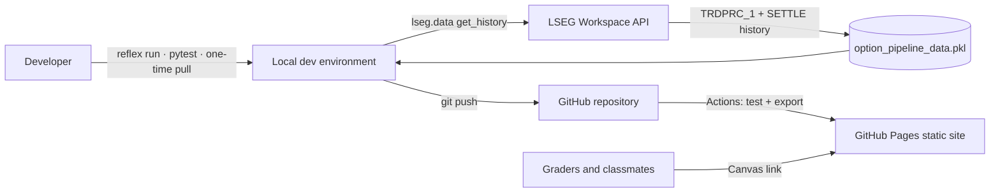
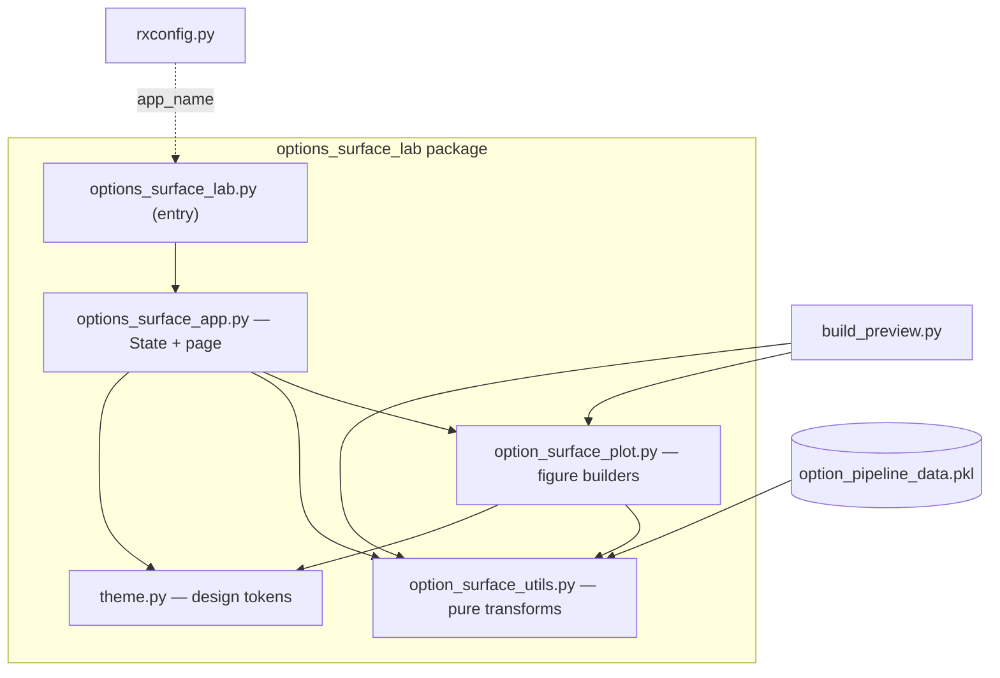
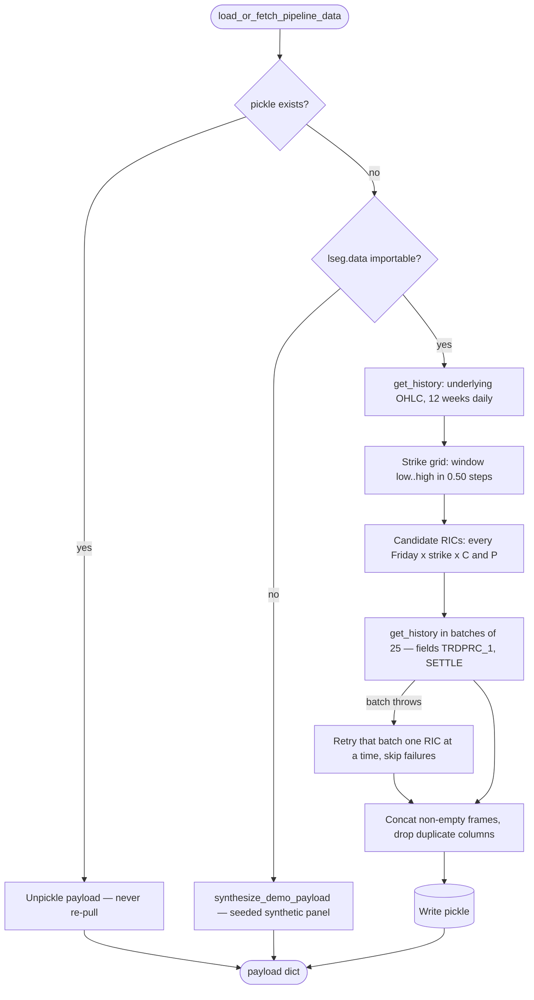
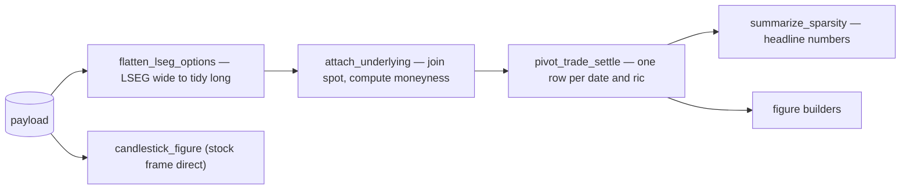
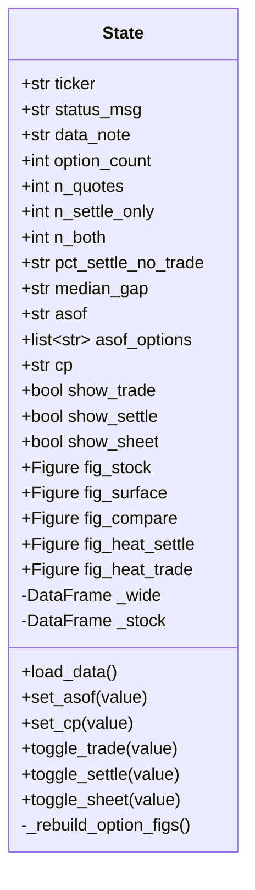
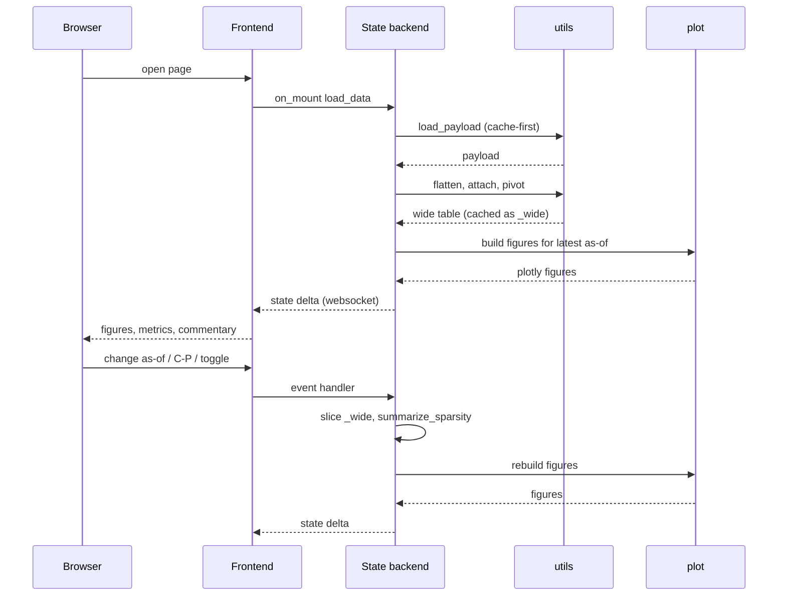
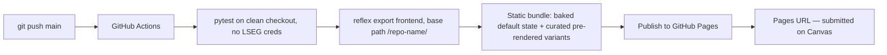

# System Specification — Options Surface Lab

| Field | Value |
|---|---|
| Status | Draft v1 — 2026-08-29 |
| Companion docs | [PRD.md](PRD.md) (what/why, FR-IDs), [ENGINEERING-PRINCIPLES.md](ENGINEERING-PRINCIPLES.md) (standards) |
| Scope | Technical design for Assignment 1.1, extension points for 1.2 |

This document describes the **target** architecture — the system once PRD FR-1 (restructure)
lands. Where today's code differs, the delta is marked with the PRD gap ID (G-1…G-8).
Requirement IDs (FR-x) refer to [PRD.md](PRD.md).

---

## 1. System context

The system is a data-visualization web app with **no runtime backend in production**. LSEG is
touched exactly once, at development time, to build a pickle cache that is committed to the
repo. Everything downstream renders from that cache.



## 2. Runtime modes

The same codebase runs three ways. Every design decision below must hold in all three.

| Mode | Command | Backend? | Interactivity | Purpose |
|---|---|---|---|---|
| **Local dev** | `reflex run` | Yes (Python, websocket) | Full: `State` event handlers | Development, checkpoint demo |
| **Static production** | `reflex export` → Pages | **No** | Client-side only (Plotly legend, `updatemenus`, pre-baked variants) | Graded submission (FR-9) |
| **Preview fallback** | `python build_preview.py` | No Reflex at all | Plotly-native only | Emergency artifact, sanity checks |

**The static-mode consequence that shapes the architecture:** with no backend, `on_mount`
handlers never fire and `State` defaults are what ships. Therefore default figures are
**computed at module import time from the committed pickle** and assigned as `State` defaults
(§8). Event handlers become a local-dev enhancement, not a rendering dependency.

## 3. Repository layout (target, per FR-1)

```
options_surface_lab/                  # repo root = Reflex project root
├── rxconfig.py                       # app_name = "options_surface_lab"
├── option_pipeline_data.pkl          # committed real LSEG cache (FR-2)
├── option_pipeline_data.synthetic.pkl # orphaned: unreadable, nothing loads it
├── option_pipeline_data.trdprc-only.pkl  # 2026-08-30 pull: no SETTLE, calls only (evidence)
├── build_preview.py                  # standalone static HTML preview
├── conftest.py                       # pytest: puts the repo root on sys.path
├── requirements.txt
├── .gitignore
├── lseg-data.config.json             # LSEG app-key — local only, gitignored, NEVER commit
├── README.md                         # assignment brief + how-to-run
├── docs/
│   ├── PRD.md
│   ├── SYSTEM-SPEC.md                # this file
│   ├── ARCHITECTURE.md
│   ├── ENGINEERING-PRINCIPLES.md
│   ├── BACKLOG.md                    # task-level build board
│   ├── RUNBOOK.md                    # operational procedures
│   └── DEMO-SCRIPT.md                # checkpoint plan
├── options_surface_lab/              # Python package (Reflex app module)
│   ├── __init__.py
│   ├── options_surface_lab.py        # thin Reflex entry: re-exports `app`
│   ├── options_surface_app.py        # State + page composition   (*app.py)
│   ├── option_surface_utils.py       # pure data transforms       (*utils.py)
│   ├── option_surface_plot.py        # figure builders            (*plot.py, renamed per G-8)
│   └── theme.py                      # design tokens (FR-8)
├── tests/
│   ├── test_ric_parsing.py
│   ├── test_transforms.py
│   └── test_iv.py                    # FR-11
├── notebooks/
│   └── 01_data_exploration.ipynb     # exploration — consumes the package, never a dependency
└── .github/workflows/deploy.yml      # pytest → export → Pages
```

Notes:

- Reflex resolves `app_name` to `options_surface_lab/options_surface_lab.py`; that file only
  imports and re-exports `app` from `options_surface_app.py`, satisfying both the Reflex
  convention and the assignment's `*app.py` naming.
- **Path resolution rule:** the cache path is anchored to the repo root via
  `Path(__file__).resolve().parents[1]`, never the process CWD — implemented in both the
  app's `CACHE_FILE` and `load_payload()`.
- *Status 2026-08-29:* layout landed (G-1/G-2/G-8 resolved); `tests/` seeded with parsing
  tests. Not yet created: `theme.py` (FR-8), `test_transforms.py`/`test_iv.py` (FR-3/FR-11),
  `.github/workflows/deploy.yml` (FR-9).

## 4. Component architecture



**Dependency rules** (enforced by review; violations are architecture bugs):

| Module | May import | Must never import | Responsibility (one reason to change) |
|---|---|---|---|
| `option_surface_utils.py` | numpy, pandas, scipy | reflex, plotly, theme | Data acquisition, parsing, reshaping, stats |
| `option_surface_plot.py` | plotly, utils, theme | reflex | Turning frames into figures |
| `theme.py` | (stdlib only) | everything else | Design tokens: palette, fonts, layout defaults |
| `options_surface_app.py` | reflex, utils, plot, theme | — | State, events, page composition |
| `build_preview.py` | utils, plot | reflex | Static HTML assembly |

This is the SRP/coupling contract from
[ENGINEERING-PRINCIPLES.md](ENGINEERING-PRINCIPLES.md): 1.2's vol-surface work extends
`utils` and `plot` without touching the page, and a restyle touches only `theme`.

## 5. Data acquisition (cache-first)

Implemented by `load_or_fetch_pipeline_data()` (app-side, writes cache) and `load_payload()`
(utils-side, read-only + synthetic fallback). The pull runs **once**; production never
touches the network (NFR-4).



Parameters (constants in the app module): `ticker_stock=UUUU.K`, `ticker_root=UUUU`,
`weeks_back=12`, `strike_step=0.50`, `batch_size=25`.

Design facts worth knowing:

- Candidate RICs are **synthesized**, not chain-walked (the chain endpoint fails on expired
  contracts — PRD guardrail #5). Most candidates never existed; empty responses are expected
  and dropped.
- The strike grid spans the window's global low→high. Known inefficiency; banding strikes
  per expiry is the sanctioned optimization if the pull is slow (FR-2, optional).
- Failure containment: a throwing batch degrades to per-RIC requests; a throwing RIC is
  skipped. The pull is monotone — it can only gain data.
- **Every response is normalised to `(RIC, Field)` before it is kept** (`_normalize_history`).
  `get_history` returns four different column shapes — MultiIndex in either order, flat RIC
  columns with the field as the axis *name* (many RICs, one populated field), and flat field
  columns with no RIC at all (single RIC). The per-RIC fallback hits that last shape, so
  without normalisation each fallback frame carried identical bare field columns and the old
  `~columns.duplicated()` dropped all but the first. Pinned by `tests/test_acquisition.py`.
- **Requested fields survive even when empty.** Dropping all-NaN columns across fields is what
  erased the SETTLE evidence on 2026-08-30 and collapsed the frame to a single level. Only
  RICs with no data in *any* field are dropped; the field axis is always complete.
- RICs are built by `build_option_ric()` / `build_candidate_rics()` in utils — the tested
  inverse of `parse_option_ric()`. `put_suffix` selects the expired-contract suffix
  convention for puts (`"right"` = README's `^R26`, `"call"` = `^F26`), which is the open
  T-27 question.
- Pre-commit check (FR-2): confirm no split in the window, else synthetic RICs miss adjusted
  contracts and the panel is silently wrong.
- **The wide table's mark column is `MARK`, not `SETTLE`** (renamed 2026-08-30). `MARK` is a
  *slot*, not a field name: US listed equity options have no settlement price, so the slot is
  filled by `MARK_FIELD_DEFAULT` (currently `MID_PRICE`). `pivot_trade_settle()` maps the
  configured mark field — and legacy `SETTLE` — into it, so the synthetic panel still works.
  Downstream columns are `has_mark`; `summarize_sparsity()` returns `n_mark_only` and
  `pct_mark_no_trade`. `CLOSE` maps to `TRDPRC_1`, not to the mark: measured, LSEG's close for
  these contracts equals the last trade in 356 of 356 overlapping observations.
- **`pivot_trade_settle()` pivots on `(date, ric)` only** and re-attaches descriptive columns
  by merge. Pivoting on `spot` made `pivot_table` delete rows whose spot was unknown —
  a hole becoming a vanished row, against AD-9 (checkpoint_audit §1, fixed 2026-08-30).
- **Field reality (measured 2026-08-30, scope: expired UUUU, 12-week window, 294 series).**
  These contracts return 22 fields and `SETTLE` is not among them; it is a futures settlement field (`CLc1` returns it in the
  same session). Requesting it yields an empty column when paired and `LDError` when asked
  for alone. Marks that *do* exist: `MID_PRICE`, `BID`, `ASK`, `THEO_VALUE`, `IMP_VOLT`,
  `OPINT_1`, plus the greeks. Evidence: `notebooks/settle_field_evidence.json`, exhibit in
  notebook 01 §10. **Which mark replaces SETTLE for FR-6/AD-9 is an open PO decision (T-32).**

### 5.1 Payload schema (the pickle contract)

| Key | Type | Contents |
|---|---|---|
| `stock` | `pd.DataFrame` | DatetimeIndex; columns `OPEN_PRC, HIGH_1, LOW_1, TRDPRC_1` (underlying daily OHLC) |
| `options` | `pd.DataFrame` | DatetimeIndex; MultiIndex columns — `(RIC, field)` **or** `(field, RIC)`; both orders must be tolerated |
| `ticker` | `str` | Underlying root, e.g. `UUUU` |
| `fetched_at` | `str` | Pull timestamp, shown in the UI data-note |
| `synthetic` | `bool` | `True` for the demo panel; drives the UI warning banner |
| `diagnostics` | `dict` | *Additive, real pulls only.* What was asked for vs what came back: `requested_fields`, `settle_field_used`, `settle_populated_on_first_try`, `mark_field_probe` (field → non-null count), `put_suffix_style` (`right`/`call`/`neither`), `n_series`, `n_calls`, `n_puts`. Exists so a pull that comes back wrong is self-documenting instead of needing forensics (T-27). |

This dict is the interface between acquisition and everything else. 1.2 may **add** keys;
existing keys and semantics are frozen.

## 6. RIC grammar

```
{ROOT}{M}{DD}{YY}{SSSSS}.U[^{M}{YY}]
```

| Element | Meaning | Parse rule |
|---|---|---|
| `ROOT` | Underlying root | `[A-Z]+`, uppercased |
| `M` | Month letter | `A–L` = Jan–Dec **calls**; `M–X` = Jan–Dec **puts** (OPRA codes, README Appendix A) |
| `DD` `YY` | Expiry day, 2-digit year | year = `2000 + YY`; invalid calendar dates → reject |
| `SSSSS` | Strike × 100, zero-padded | `01250` → `12.50` |
| `.U` | Venue qualifier | optional in the parser |
| `^{M}{YY}` | Expired-contract suffix | optional; repeats month letter + year |

`parse_option_ric()` is case-insensitive and returns
`{ric, root, cp, expiry, strike, month_code}` or `None`; `flatten_lseg_options()` silently
drops columns whose RIC doesn't parse. Example:
`UUUUA152601250.U^A26` → UUUU · 2026-01-15 · call · $12.50.
(The README's printed example carries an extra digit vs its own Appendix A grammar; the
9-digit form above is what the parser and the starter's RIC generator both implement.)

## 7. Data pipeline

Pure-function chain in `option_surface_utils.py`; each stage is independently testable
(FR-3, NFR-2).



### 7.1 Tidy long table (after `flatten` + `attach`)

One row per **(date, ric, field)** observation. Non-finite values dropped; `dte < 0` rows
dropped.

| Column | Type | Definition |
|---|---|---|
| `date` | Timestamp (normalized) | Observation day |
| `ric`, `root`, `cp`, `month_code` | str | From RIC parse; `cp ∈ {C, P}` |
| `expiry` | Timestamp | Contract expiry |
| `strike` | float | Dollars |
| `field` | str | `TRDPRC_1` or `SETTLE` (uppercased) |
| `value` | float | Price in dollars |
| `dte` | int ≥ 0 | `(expiry − date)` in calendar days |
| `spot` | float | Underlying `TRDPRC_1` that day; if missing, **nearest prior session** |
| `moneyness` | float | `strike / spot` |

### 7.2 Wide table (after `pivot_trade_settle`) — the app's working frame

One row per **(date, ric)**; the interface consumed by every figure and by 1.2.

| Column | Definition |
|---|---|
| `date, ric, root, cp, expiry, strike, dte, spot, moneyness` | Carried from tidy |
| `TRDPRC_1` | Last trade that day (NaN = no print). `CLOSE`, if ever present, is folded in here |
| `SETTLE` | Exchange mark (NaN = not listed / no settle) |
| `has_trade`, `has_settle` | Non-null flags |
| `abs_diff` | `abs(SETTLE − TRDPRC_1)` |
| `rel_diff` | `abs_diff / SETTLE`, NaN when settle is 0 |

Duplicate observations collapse via `aggfunc="last"`.

### 7.3 Sparsity statistics (`summarize_sparsity`) — FR-6 source of truth

Over a slice (normally one as-of date): `n_quotes` (rows), `n_settle_only`
(`has_settle & ~has_trade`), `n_trade_only`, `n_both`,
`pct_settle_no_trade = 100 · mean(settle_only)`, `median_abs_diff` and
`median_rel_diff_pct` over rows with both (None when the set is empty), `n_dates`,
`n_series`. Empty input returns zeros/None — never raises.

### 7.4 Interpolated sheet (`surface_grid`)

`scipy.interpolate.griddata(method="linear")` over `(strike, dte) → value`, sampled on a
40×30 regular grid. Returns `None` below 8 cloud points. **No extrapolation: cells outside
the convex hull stay NaN**, so Plotly leaves holes over empty wings rather than inventing a
sheet — this is a domain guardrail (PRD §2.2), not an implementation detail.

## 8. Application layer (Reflex)

### 8.1 State



- `_wide` (underscore = backend-only, never serialized to the client) caches the pivoted
  frame so every control change re-slices in memory — **no re-parse, no re-load, no network**
  per interaction.
- All five figures rebuild together from the `(asof, cp, toggles)` tuple; an empty slice
  yields themed empty figures, never an exception.
- Displayed strings (`pct_settle_no_trade`, `median_gap`) are formatted in the handler, not
  in components — FR-6's numbers exist as ready-to-render text. *Delta from today (G-3): the
  percent is computed but not yet placed on the page.*

### 8.2 Interaction sequence (local mode)



### 8.3 Static-mode rendering (no backend)

The exported site cannot run the sequence above past "open page". Design response:

1. **Import-time baking.** At module import, the pickle is loaded, the pipeline runs, and
   the default figures/metrics are computed and assigned as `State` **defaults**. `reflex
   export` serializes those defaults into the static build, so the published page is fully
   populated with real data before (and without) any backend. `on_mount` load becomes
   idempotent local-dev refresh.
2. **Client-side controls.** Series visibility (SETTLE / TRDPRC_1 / sheet / spot plane) is
   handled by Plotly **legend toggling** inside each figure. As-of date and C/P (and FR-10's
   K vs K/S axis) are Plotly `updatemenus` dropdowns/buttons toggling pre-rendered trace
   sets within one figure, over a **curated** date list (last ~5 sessions) to cap bundle
   size.
3. **Omissions.** The "Reload data" button is not rendered in the exported page (dead
   without a backend).
4. The Reflex `State` switches remain for local dev and the checkpoint demo; they and the
   legend must not fight (switches control trace inclusion at build; legend controls
   visibility client-side).

## 9. Figure inventory

All builders live in `option_surface_plot.py`, take the wide table (or stock frame) plus an
as-of/cp selection, and return `go.Figure`. All pull colors/fonts/layout from `theme.py`
(FR-8; *today they hardcode hex values — G-5*).

| Figure | Builder | Encodes | Static interactivity |
|---|---|---|---|
| Underlying candlestick | `candlestick_figure` | OHLC context; caption noting close = `TRDPRC_1`, not a settle | Plotly zoom/pan |
| 3D price surface (FR-4) | `price_surface_figure` | X strike (or K/S, FR-10), Y DTE (reversed — near-dated toward viewer), Z price; SETTLE markers, TRDPRC_1 diamonds, translucent interpolated sheet, spot plane (FR-12) | Legend toggles per trace; updatemenus for date/cp/axis |
| Settle vs trade (FR-5) | `settle_vs_trade_figure` | Scatter vs `y = x` (off-diagonal = mark ≠ print), colored by C/P; bars of settle-only / both / print-only counts | Hover, legend |
| Occupancy heatmaps ×2 | `coverage_heatmap` | (expiry × strike) grid, lit = a number exists that day; one per field, chronologically ordered expiries | Hover |
| IV surface (FR-11) | *new* `iv_surface_figure` | Black–Scholes IV inverted from SETTLE; assumptions captioned on-figure | Legend, hover |

Marker-identity invariant (FR-5): SETTLE and TRDPRC_1 differ in **both** color and symbol
(circle vs diamond) in every theme, and the sheet stays translucent and legend-labeled as
interpolation.

## 10. Theme system (FR-8)

`theme.py` is the single source of visual truth:

- **Tokens:** background, surface, border, text, muted-text, accent-settle, accent-trade,
  accent-put, font stacks. Semantic names, not color names — the restyle changes values,
  not call sites.
- **`figure_layout(**overrides) -> dict`:** shared Plotly layout defaults (template, paper/plot
  colors, font, margins, title style) merged into every figure — deleting today's copy-pasted
  layout blocks (duplicated-code smell).
- Both worlds consume it: Plotly builders and Reflex component styling.
- Acceptance mirror of FR-8: zero color/font literals outside `theme.py`.

## 11. Synthetic data generator (dev/test infrastructure)

`synthesize_demo_payload(seed=7)` produces an LSEG-shaped payload with the teaching
properties baked in, and doubles as the **deterministic test fixture** (NFR-2):

- Underlying: seeded geometric-ish walk around $8, clipped to [3.5, 16].
- Listing rule: a series exists (gets a SETTLE) when `|ln(K/S)| < 0.55` or `dte < 21`.
- SETTLE model: intrinsic + ATM-peaked time value; TRDPRC_1 = noisy perturbation of settle.
- Print probability: 0.80 near-money ≤ 5 DTE; 0.55 near-money ≤ 21 DTE; 0.18 near-money
  otherwise; 0.04 far from money — reproducing "settles everywhere, prints only where
  people trade."

Same seed → identical panel **within a single day**: the window is anchored to
`dt.date.today()`, so exact derived values drift across dates. `tests/test_transforms.py`
therefore asserts structure and relationships on this fixture, and keeps exact-value
assertions on hand-built panels. See PRD OQ-6.

## 12. Stretch-feature designs (P1)

- **FR-10 moneyness axis:** the wide table already carries `moneyness`; the surface builder
  takes `x_mode ∈ {strike, moneyness}` and re-labels the X axis. Static site: an
  `updatemenus` axis toggle (pre-rendered trace pair).
- **FR-11 IV inversion (in `utils`, pure):** European Black–Scholes, price = SETTLE, `S` =
  as-of spot, `T = dte/365`, constant `r` (value: PRD OQ-2, printed on the page), no
  dividends. Solve for σ by Brent/bisection on [1e-4, 5]. **Skip (NaN) rather than solve**
  when `dte = 0`, SETTLE ≤ intrinsic + ε, or the solver fails to bracket — degenerate
  inputs must produce gaps, not crashes or absurd vols. Caveat rendered with the figure:
  American-exercise and dividend effects ignored; this IV is not a tradable price.
  Test: BS-price a known (σ, K, T), invert, recover σ within tolerance.
- **FR-12 spot plane (in `plot`):** constant-x `go.Surface` at `x = spot(asof)` spanning the
  slice's DTE and price ranges, low opacity, its own legend entry so it toggles like the
  sheet.

## 13. Error handling and edge cases

The system's posture: **degrade to an honest empty, never fabricate, never crash.**

| Condition | Behavior |
|---|---|
| Empty/None options frame | Empty tidy frame with correct columns; empty themed figures |
| RIC fails to parse | Column silently dropped in flatten |
| Non-numeric / non-finite value | Observation dropped |
| Observation after expiry (`dte < 0`) | Row dropped |
| No spot for a date | Nearest **prior** session's close; NaN if none exists |
| `SETTLE = 0` | `rel_diff` = NaN (no divide-by-zero) |
| < 8 points for the sheet | No sheet trace (`surface_grid` returns None) |
| Empty as-of slice | Themed "no quotes on this date" figure |
| Both-empty stats | Percent = 0, medians = None → rendered "n/a" |
| LSEG batch failure | Per-RIC retry; individual failures skipped (§5) |
| Degenerate IV inputs | NaN, rendered as a hole (§12) |

## 14. Build and deployment pipeline (FR-9)



- CI runs the tests first — the export only builds from a green tree, and the test job also
  proves NFR-4 (everything works without credentials, off the committed pickle).
- **Base path:** project Pages serve under `/<repo>/`; the export's URL/asset prefix must be
  set accordingly or the page loads blank (PRD risk table). Verified early on a test deploy,
  in incognito.
- plotly.js may load from CDN to keep the bundle small; the pickle itself is **not** shipped
  to the client — only the figures baked from it.
- Emergency fallback: `build_preview.py`'s single-file HTML can be published to Pages as-is
  if the Reflex export misbehaves near the deadline.

## 15. Extension points for Assignment 1.2

| 1.2 need | Where it plugs in |
|---|---|
| Vol surface construction | New pure functions in `utils` consuming the **wide table** (§7.2) — the frozen interface |
| Simulated fills | New `utils` module; reads wide table + IV surface; UI gets a new page via `app.add_page` |
| More data fields / dates | New pickle keys (additive only, §5.1); flatten already tolerates extra fields like BID/ASK in its field-detection set |
| New visuals | New builders in `plot`, themed via `theme.py`, added to the page — existing figures untouched |
| This page's future | Moves from `/` to its own route when the site becomes multi-page; no intra-page rework required |

## 16. Invariants (quick review checklist)

- [ ] Production renders with zero network calls (cache/synthetic only)
- [ ] `utils` imports no UI library; `theme` imports nothing project-local
- [ ] No color/font literals outside `theme.py`
- [ ] SETTLE vs TRDPRC_1: distinct color **and** symbol, everywhere
- [ ] Interpolation never extrapolates beyond the data's convex hull, and is always labeled
- [ ] Missing data renders as holes/empties, never fabricated values, never exceptions
- [ ] Static site fully populated without a backend (import-time baking)
- [ ] Paths anchored to `__file__`, never CWD
